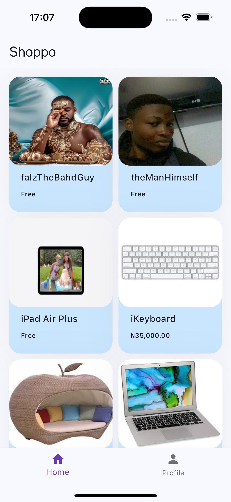
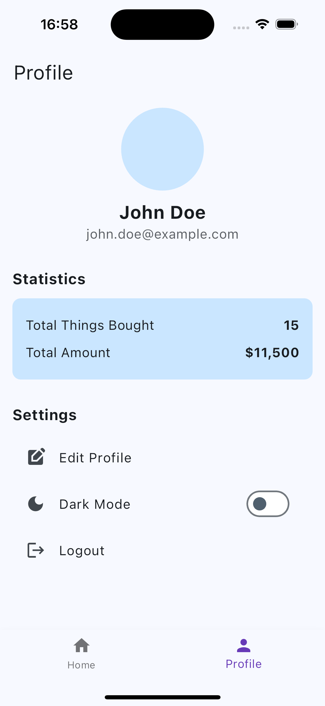
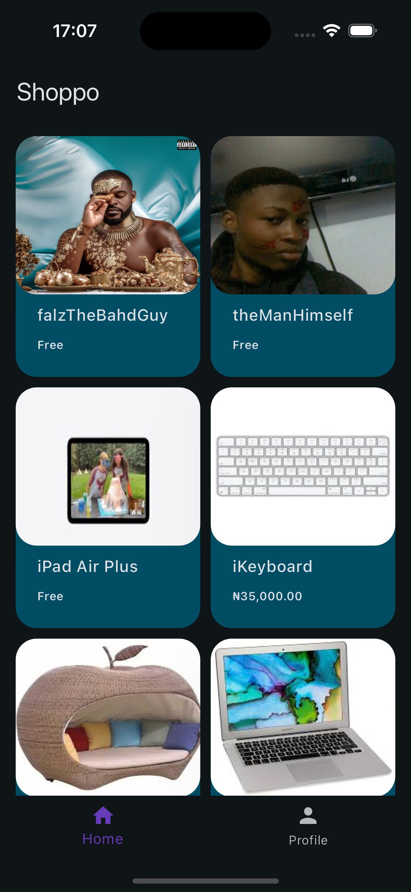
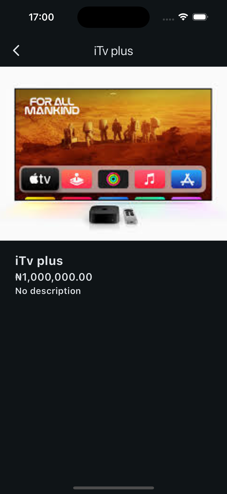

# HNG TASK 2

This is my assignment submission for the HNG stage two task. I was tasked to create a simple shopping app that has two items on the dashboard and displays items statically.

## Features

- Display a static list of products.
- Add and remove items from the checkout list.
- Navigate to an order successful screen from the checkout screen.
- Built using only native Flutter components (no third-party dependencies).

## Screenshots

### Home Screen displaying my list of products.



### Description screen displaying item information


### Profile screen to add more completion



### Home Screen displaying my list of products in dark mode.



### Description screen displaying item information in dark mode



## Setup Instructions

### Prerequisites

- Flutter installed on your machine. Follow the instructions [here](https://flutter.dev/docs/get-started/install) to install Flutter.

### Steps

1. **Clone the Repository**

   ```sh
   git clone https://github.com/immadominion/simple_shopping_app.git
   cd simple_shopping_app

   ```

2. **Get Flutter Packages**

   ```sh
   flutter pub get

   ```

3. **Run the App**
   ```sh
   flutter run
   ```

## Appetize Demo

- You can view a live demo of the app on Appetize.io ==> ([here](https://appetize.io/app/b_cuavp4bfsskrtx3l7jfmezkyhy))

## Project Structure

    lib/
    |- core/
    |   |- constants/
    |   |   |- enum.dart
    |- data/
    |   |- model/
    |   |   |- product_model.dart
    |   |   |- profile.json
    |   |- controllers/
    |   |   |- base_controller.dart
    |   |   |- dashboard_controller.dart
    |   |   |- products_controller.dart
    |   |   |- switch_controller.dart
    |   |   |- theme_notifier.dart
    |   |- services/
    |   |   |- dio_mixin.dart
    |   |   |- error_service.dart
    |   |   |- product_services.dart
    |- presentation/
    |   |- screens/
    |   |    |   |- home.dart
    |   |    |   |- profile.dart
    |   |- widgets/
    |    |   |   |- home/
    |    |   |   |   |- card_widget.dart
    |    |   |   |   |- home_description.dart
    |    |   |   |   |- home_image.dart
    |    |   |   |- profile/
    |    |   |   |   |- profile_stat.dart
    |    |   |- my_fade_route.dart
    |    |   |- shimmer.dart
    |- utils/
    |   |- locator.dart
    |- home.dart
    |- main.dart
